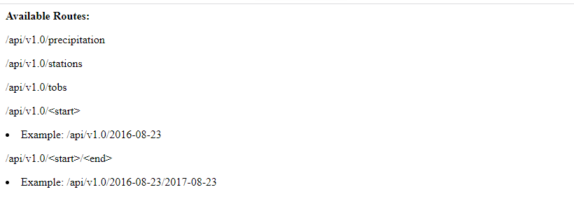
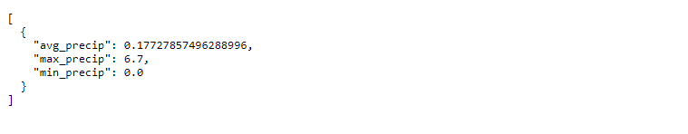
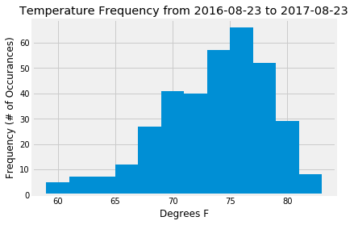
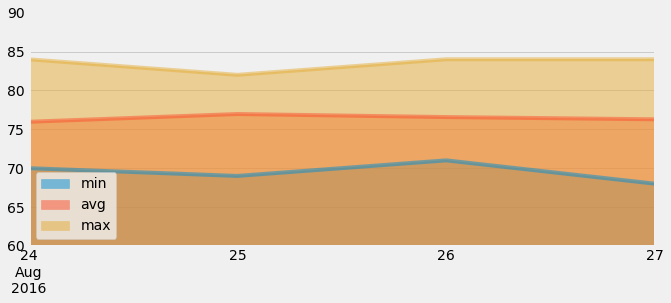

# sqlalchemy-flask-api-weather  

Author:  Erin James Wills, ejw.data@gmail.com 

<cite>Photo by [NASA](https://unsplash.com/@nasa?utm_source=unsplash&utm_medium=referral&utm_content=creditCopyText) on [Unsplash](https://unsplash.com/s/photos/weather?utm_source=unsplash&utm_medium=referral&utm_content=creditCopyText)</cite>  

 

## Overview  

The purpose of this repo is to become familiarized with SQLAlchemy's Object Relational Mapper (ORM).  To do this I will be using a SQLite database that has two tables about Hawaii weather (measurements and stations).  The code associated with this project can be found in the analysis folder within a jupyter notebook named `climate_analysis.ipynb`. In addtion to analyzing the data, a Flask API was created that connects to the database and accepts five different API requests - three of the requests return a predefined query result but the other two API's allow for the user to include one or two user inputs that are used within the API request as database filters.   

 

## Technologies
* Python
* Pandas
* SQLAlchemy
* Flask
* SQLite

 

## Data Source
Dataset generated by Trilogy Education Services. Origins beyond this is unknown. 

 

## Setup and Installation  
1. Environment needs the following:  
    * Python 3.6+
    * pandas
    * flask
    * sqlalchemy.ext.automap
    * sqlalchemy.orm
    * datetime
    * numpy
1. Activate your environment
1. Clone the repo to your local machine
1. Start Jupyter Notebook within the environment from the repo
1. Run `climate_analysis.ipynb` to test connections and queries
1. To run the flask app:
    *  In terminal, navigate to the top-level repo folder
    *  Activate your environment
    *  In terminal run:  `python app.py`
    *  The routes that can be used are listed on the page.

 

## Examples  

<figure>

<figcaption>Fig.1 - API route options displayed in a browser</figcaption>
</figure>

 

<figure>

<figcaption>Fig.2 - API results returning a single day's precipation and temperature measurements</figcaption>
</figure>  

 

<figure>

<figcaption>Fig.3 - Matplotlib histogram of temperatures returned from a date range query</figcaption>
</figure>  

 

<figure>

<figcaption>Fig.4 - Matplotlib stacked area chart of temperatures returned from a date range query</figcaption>
</figure>  

 